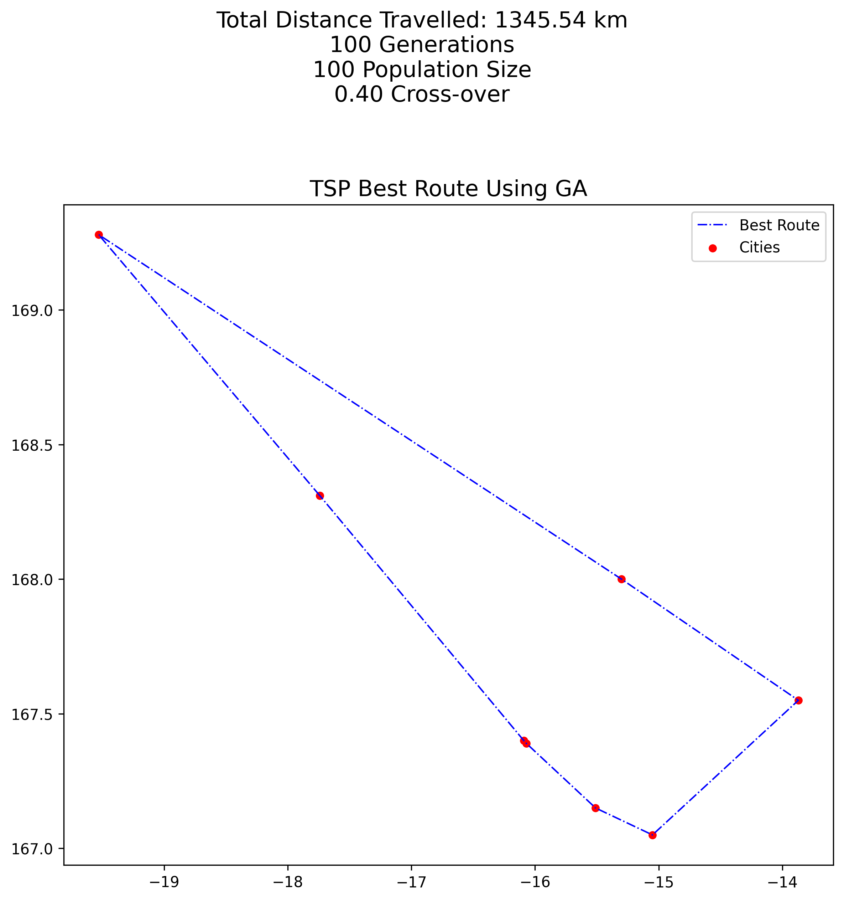
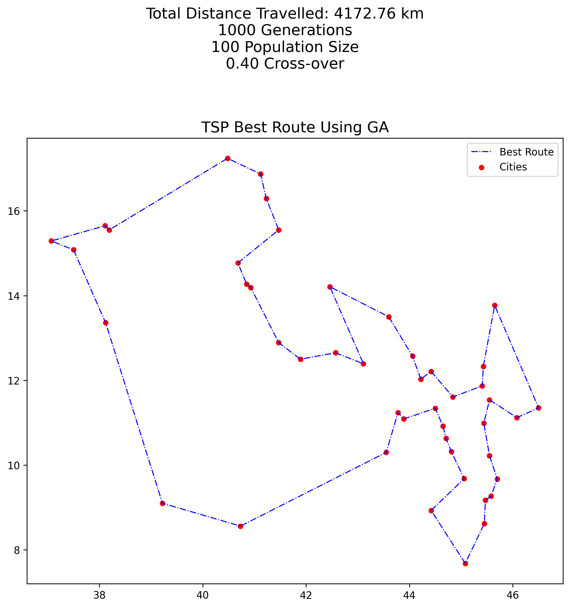
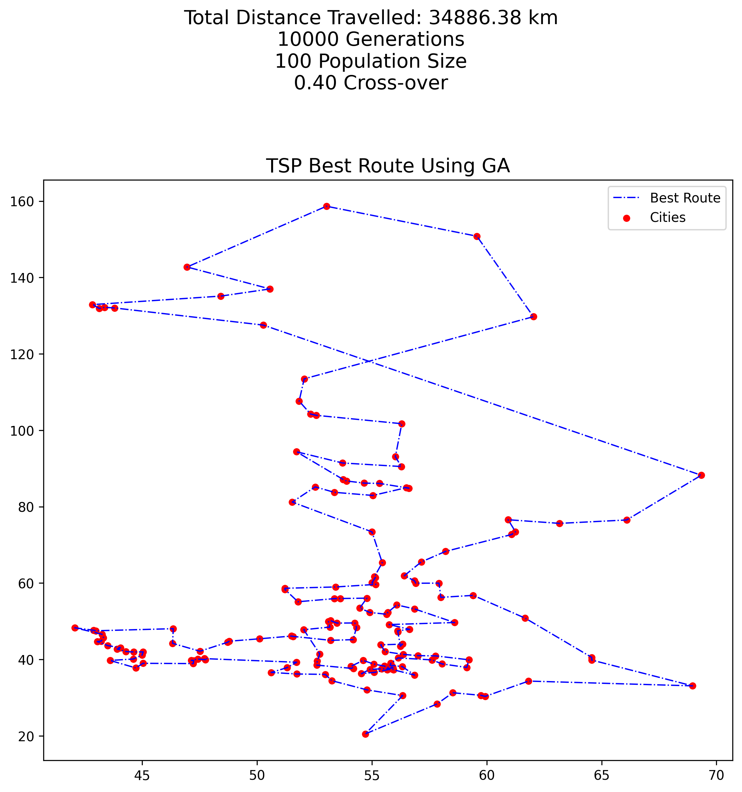
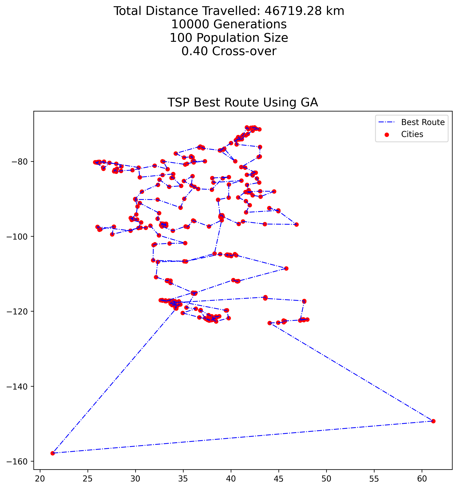
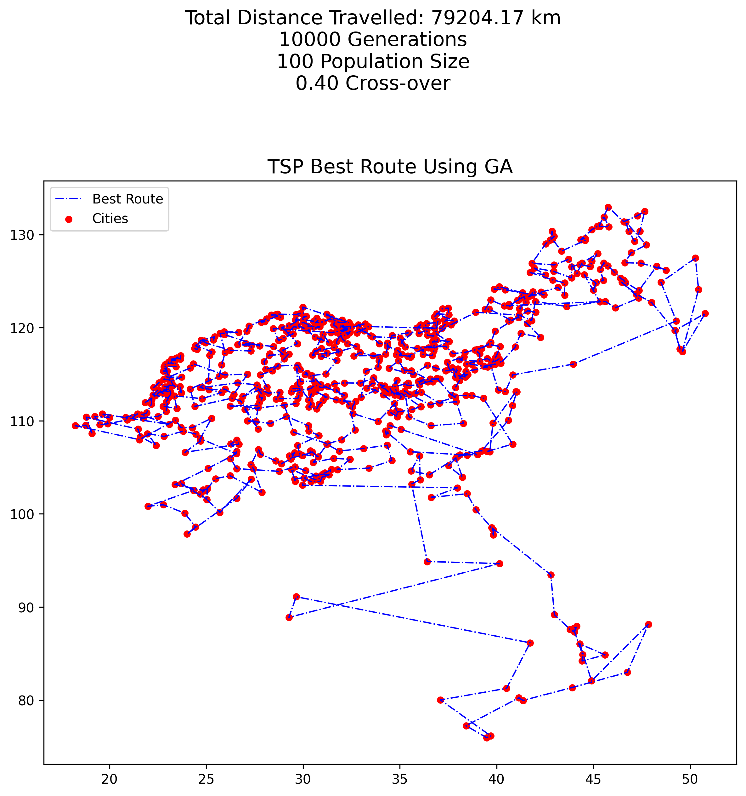
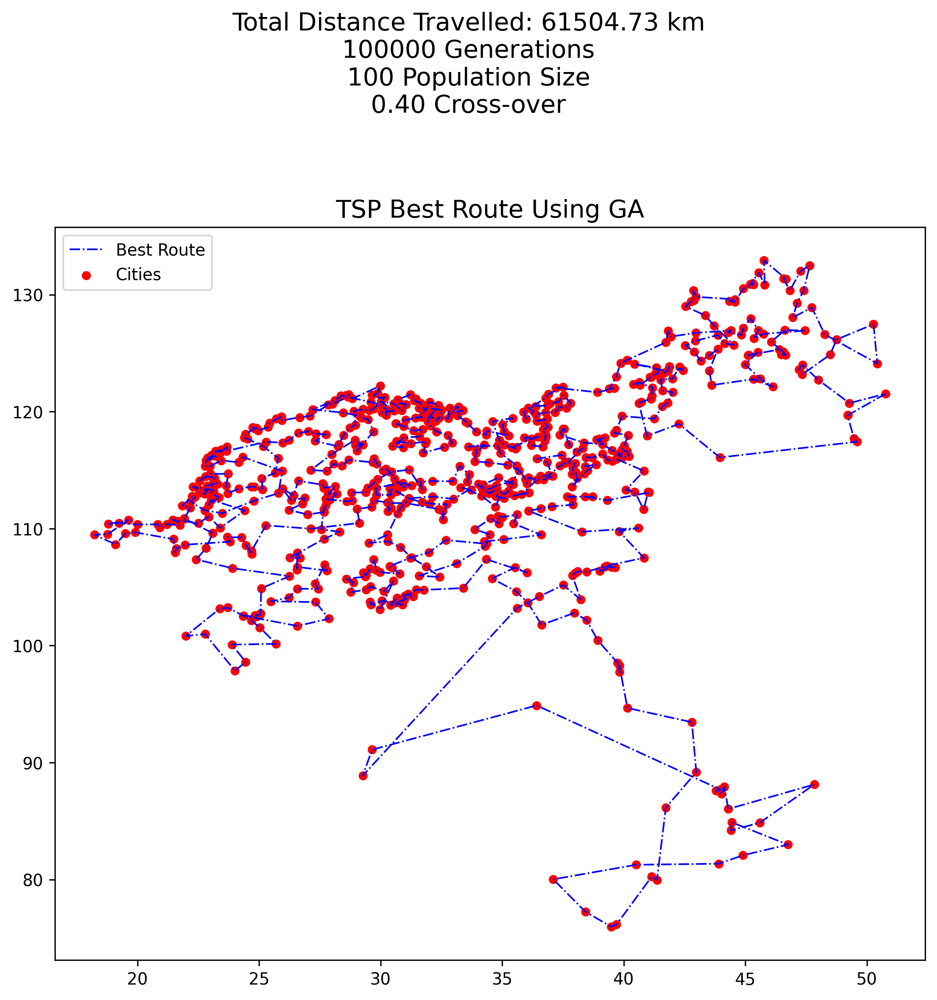

# Travelling Salesman Problem &#128681;

Explore optimization techniques for solving the **TSP** problem, using both a fast but approximate algorithm and a slower, yet more accurate one.

## Description
This project addresses the *Travelling Salesman Problem* (TSP), using two different approaches: a *greedy approach* that, from time to time, moves to the nearest city and an *evolutionary algorithm* based on *mutation* and *cross-over* operators. The performance of the algorithms are evaluated in terms of cost and number of steps accross various instances. TSP instances can be found in the following Wolfram Notebook: https://www.wolframcloud.com/obj/giovanni.squillero/Published/Lab2-tsp.nb.

## Greedy Algorithm
The **greedy** algorithm starts from a city and iteratively jumps to the nearest unvisited one. This process continues until all cities are visited. It's relatively fast, but it only provides a solution that approximates the shortest route. In the table below, the results obtained using the greedy algorithm and the optimal ones are compared. All costs are reported in *km*. China optimal route cost must be computed. It is not available in the Wolfram Notebook cited above.
| Instance | No. cities | Greedy Route Cost | Optimal Route Cost | Difference |
| -------- | ---------- | ----------------- | ------------------ | ---------- |
| Vanuatu  | 8          | 1475.53           | 1345.54            | +129.99    |
| Italy    | 46         | 4436.03           | 4172.76            | +263.27    |
| Russia   | 167        | 42334.16          | 32722.50           | +9611.66   |
| US       | 340        | 48050.03          | 39016.62           | +9033.41   |
| China    | 746        | EA is used        | to be computed     | to be computed |

## Evolutionary Algorithm
The **evolutionary** algorithm iteratively evolves a population of individuals over a predefined number of generations (`NUM_GENERATIONS`). Using parents selection, mutation and cross-over, the algorithm explores and exploits the solution space effectively, aiming to find the optimal or a near-optimal solution to the TSP problem.

**Process**
- **Generating initial population**: initialize a population of `POPULATION_SIZE` *random* individuals, where each individual represents a unique route of the cities. In the first version of the algorithm, each individual was constructed by randomly permuting (shuffling) the order of cities. However, this technique provided initial solutions that were too far from the optimal, requiring an excessive number of generations to converge. In the second version of the algorithm (the one proposed in the notebook), the initial population is created using a more *greedy* approach. Instead of starting with purely random permutations, each individual begins from a randomly selected city and follows a "greedy neighbor" heuristic to build the path;
- **Cross-over**: a new offspring is constructed crossing over two selected parents, chosen through a *Tournament selection* process. Cross-over occurs with a certain probability (`CROSSOVER_PROBABILITY`). The resulting offspring, obtained through the *Inver-over* crossover, is a new individual that asymmetrically inherits more traits from the first parent than the second parent. This asymmetry allows the offspring to mantain a strong similarity to the first parent, while incorporating some diversity from the second parent;
- **Mutation**: a new offspring is constructed mutating a selected parent, chosen through a *Tournament selection* process. Mutation occurs with a certain probability (`1-CROSSOVER_PROBABILITY`). The resulting offspring is obtained through the *Displacement* mutation, that cuts the genes between two randomly cut-points (*start*, *end*) from the chromosome of the parent and then inserts them, starting from a randomly selected location;
- **Hill climbing**: a simple hill climbing technique is integrated into the genetic algorithm (GA) to enhance the optimization process. A constraint based on maximum number of attempts (`MAX_ATTEMPTS`) is imposed. This to prevent excessive computational effort.

The process of cross-over, mutation and hill climbing continues until the number of generated offsprings reaches the desidered size (`OFFSPRING_SIZE`). Then, the population is extended and only the fittest `POPULATION_SIZE` individuals are retained for the next generation.

## Routes Plots and Conclusions
Vanuatu, Italy, Russia, US and China TSP plots are displayed below in this order. The first plot refers to Vanuatu, the second plot to Italy etc. 

⚠️ While the optimal solution was achieved for the first two instances (Vanuatu and Italy), there is certainly room for improvement for the next three, despite numerous experiments being carried out. There have been various mutation and crossing over strategies tested and various combinations of parameters `CROSSOVER_PROBABILITY`, `OFFSPRING_SIZE` and `MAX_ATTEMPTS`, but the algorithm did not lead to better solutions than those reported below. 

🏆 **10_000 generations for Russia, US and China**: since the result obtained with only 10_000 generations is not that far from optimal (34866.38 vs 32722.50 for *Russia* and 46719.28 vs 39016.62 for *US*), the algorithm should not be badly structured. Probably with a greater `POPULATION_SIZE` (*e.g.* 20_000 for US instance, 100_000 for China instance), it would reach the optimum.
The process would become very expensive in computational terms and my calculator (a humble and now old laptop) isn't that good. It takes tens of minutes, also hours to calculate the result :(. Trying with a number of generations equal to 100_000 and waiting 200 minutes (process not yet finished), the result of the sixth figure is obtained.

## Contributions 
If you have any advice and you want to contribute to this project, don't hesitate to open an issue, fork the repository and submit a pull request.

## Contact
For questions, contact me at agnesere43@gmail.com.